# Java 17 更新了点儿啥？

**Java Java17**

> 

==  Java|Java17 ==

朋友们大家好，我是 bennyhuo，今天我们来聊聊 Java 17 的更新。

## 更快的 LTS 节奏

Java 17 更新了，作为一个 10 年的 Java 程序员（不是，最近 5 年都主要在写 Kotlin 了其实），还是有亿点点兴奋的，Kotlin 的群里面也是各种讨论 Java 的新特性。

我记得五六年前，谈论起当时刚刚进入人们视野不久的 Java 8，大家还是一副“我们公司还在用 Java 6” 的表情，现在想想 [RetroLambda](https://github.com/luontola/retrolambda) 都已经是很久远的事儿了：


现在的 Java 8 可能大概相当于那时候的 Java 6 吧，在使用上已经非常普遍了，甚至已经有一点儿过时：就连 Android 最近也开始从最新的 Android Studio 版本开始把 Java 11 作为默认版本了。


现在 Java 17 的发布，让 Java 11 成了 LTS 系列的次新版本，Java 8 离老破小的距离也越来越近了 —— 不仅如此，Java 官方还想要加快这个节奏，因为他们打算把 LTS 发布的节奏从三年缩短到两年。这么看来，下一个 LTS 将会是在 2023 年 9 月发布的 Java 21。

这个就很有意思了。Java 的版本发布以前是何其佛系，版本号也是 1.x 这样一路走来，从 1.0 （1996 年） 发布到 1.5（2004年） 就花了近 10 年，然后又花了差不多 10 年到了 1.8（2014 年）。这其中从 1.5 开始启用了新的版本号命名方式，即  Java SE 5，Java SE 8 这样的叫法。直到现在，2021 年，不管 Java 有没有变化，Java 的版本号已经发生了质的飞跃。


从 2017 年 9 月发布的 Java 9 开始了每 6 个月一个版本的节奏，这样对于喜欢尝鲜的开发者来讲，Java 的一些新特性就可以很快的在非 LTS 版本当中获取到。这个时间点是非常微妙的，Kotlin 1.0 是 2016 年 2 月发布的，Google 在 2017 年 5 月官宣 Kotlin 为 Android 的一级开发语言（首选语言的宣布是在 2019 年的 IO 大会上）。后来我们就看到，Java 越来越像 Kotlin 了，Java 10 有了 var：

```java
var list = new ArrayList<String>(); // infers ArrayList<String>
var stream = list.stream();         // infers Stream<String>
```

Java 13 有了多行字符串字面量：

```java
String html = """
              <HTML lang="en">
                  <body>
                      <p>Hello, world</p>
                  </body>
              </html>
              """;
```


Java  14 有了 switch 表达式（12 开始预览）：

```java
int ndays = switch(month) {
    case JAN, MAR, MAY, JUL, AUG, OCT, DEC -> 31;
    case APR, JUN, SEP, NOV -> 30;
    case FEB -> {
        if (year % 400 == 0) yield 29;
        else if (year % 100 == 0) yield 28;
        else if (year % 4 == 0) yield 29;
        else yield 28; }
};
```

Java 16 加入了模式匹配（Java 14 开始预览），以下示例在效果上类似于 Kotlin 的智能类型转换：

```java
if (obj instanceof String s) {
    System.out.println( s.length() );
}
```

还有数据类（Java 14 开始预览）：

```java
record Point(int x, int y) { }
Point p = new Point(3,4);
System.out.println( p.x() );
```

可以说，Java 重新焕发了生机，喜欢 Java 的开发者们再也不必等待漫长的版本更新了。


而对于我，一个最近专注于 C++ 视频的 Kotlin 布道师来讲，我觉得挺好，卷起来呀，不然我拿什么更新视频呢！


好了，我们简单回顾了一下 Java 的历史，接下来就一一看一下这次 Java 的更新内容吧。

## JEP 306: Restore Always-Strict Floating-Point Semantics

看到这个标题的时候，我就知道很多人蒙了。因为这玩意历史感太强了，说实话我也没怎么接触过。

刚发布的那天 Kotlin 的群里短暂地提到了这一条，结果大家都以为是这玩意儿：

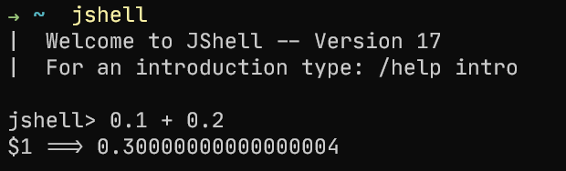

看到 0.3 后面那高贵的 4 了吗，正是因为它的存在，0.1 + 0.2 跟 0.3 不一样！

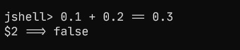

这恐怕没什么令人惊喜的，稍微有点儿被坑经历的小伙伴都不会这么被坑，对吧，对吧，对吧。说起这事儿，我记得我以前在地图行业的时候计算经纬度，我们都要先把经纬度乘以 10^6 转成整型来计算，就是为了防止精度丢失，记得我当年刚入职腾讯地图的第一天，隔壁的大哥就因为给微信接入地图 SDK 时遇到了 Marker 反复横跳的事情，就是跟精度有关。


可是，这个所谓的 strict fp 跟这个高贵的 4 有关系吗？如果有关系，那这次更新是特意加入了这个高贵的 4 吗？显然不应该这么搞笑。因为这个高贵的 4 其实是 源自于 IEEE 754 对浮点型的定义，其他语言只要是按照标准实现了浮点型，结果也是一样的：

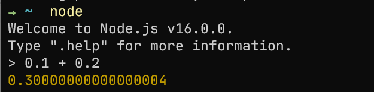

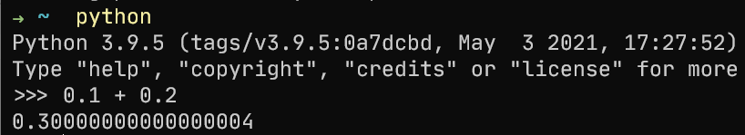

所以这个 strict fp 是什么呢？

Java 从 1.2 开始引入了一个关键字：strictfp，字面意思就是严格的浮点型。这玩意儿居然还有个关键字，可见其地位还是很高的。

那么问题来了，为什么要引入这么个奇怪的东西呢？我翻了翻文档发现（不然还能怎样，那个时候我才刚开始学五笔。。。），在上世纪 90 年代，Java 虚拟机为了保持原有的浮点型语义，在兼容 x86 架构的处理器上执行 x87 指令集（是 x86 指令集的一个关于浮点型的子集）的情况时需要花较多的开销，使得性能上有些令人不满意，于是加入 strictfp 来表示原有的浮点型语义（即 IEEE 754 规定的那样），而默认的浮点型则采用了更加宽松的语义，这样算是一个折中的方案。使用 strictfp 很多时候就是为了确保 Java 代码的可移植性，这其实也不难理解。

不过，这个问题很快得到了解决。在 SSE2 (Streaming SIMD Extensions 2) 扩展指令集随着奔腾 4 发布以后，Java 虚拟机有了直接的方式来实现严格的浮点型语义，于是这个问题就不再存在了。

显然，对于我们绝大多数程序员来讲，特别是后来的所有 Android 开发者来讲，这个问题根本不存在。说着我自豪得看了一眼旁边的 Apple Silicon  。。。


如果你对这个点有兴趣，那么我建议你翻一下老版本当中的 StrictMath 这个类，你依稀还可以看到一些对 strictfp 的使用。在 Java 17 当中，StrictMath 已经完全沦为 Math 的马甲了。 

**Java 16**

```java
public static strictfp double toRadians(double angdeg) {
    // Do not delegate to Math.toRadians(angdeg) because
    // this method has the strictfp modifier.
    return angdeg * DEGREES_TO_RADIANS;
}
```

**Java 17**

```java
public static double toRadians(double angdeg) {
    return Math.toRadians(angdeg);
}
```

我们也不妨看一下 Android 的实现：

**Android 30**

```java
public static strictfp double toRadians(double angdeg) {
    // Do not delegate to Math.toRadians(angdeg) because
    // this method has the strictfp modifier.
    return angdeg / 180.0 * PI;
}
```

Android 这里还做了点儿优化，把 DEGREES_TO_RADIANS 给去掉了。


## JEP 356: Enhanced Pseudo-Random Number Generators

相比上一条更新，这一条更新实用多了。

我们都用过随机数，不过一般情况下我们很少去认真的对待随机数的具体结果，就好像它是真的随机一样。

```java
var random = new Random(System.currentTimeMillis());
for (int i = 0; i < 10; i++) {
    System.out.println(random.nextInt());
}
```

实际上 JDK 当中还提供了另外几个随机数的成员：

* ThreadLocalRandom：单例，提供线程间独立的随机序列，多个线程用到这个实例，也会在线程内部各自更新。它同时也是 Random 的子类，不过它几乎把所有 Random 的方法又实现了一遍。
* SplittableRandom：非线程安全，但可以 fork 的随机序列实现，适用于拆分子任务的场景。

ThreadLocalRandom 继承自 Random，而 SplittableRandom 与它俩则没什么实际的关系，因此如果我们在代码当中想要动态切换 Random 和 SplittableRandom 就只能定义两个成员，并且在用到的地方做判断：

**Java 16**

```java
SplittableRandom splittableRandom = ...;
Random random = ...;

boolean useSplittableRandom = false;

...
    
if (useSplittableRandom) {
   nextInt = splittableRandom.nextInt();
} else {
    nextInt = random.nextInt();
}
```

而且如果想要自己扩展随机数的算法，也只能自己去实现，原有的定义方式缺乏一个统一的接口。


Java 17 为了解决这个问题，定义了几个接口：

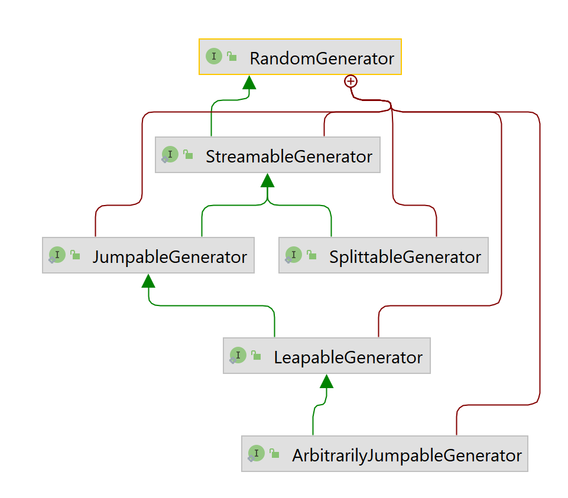

这样我们就可以面向接口编程啦~


另外，尽管各个实现的细节不太一样，但思路基本上一致，因此老版本当中的几个随机数的类当中存在大量重复或者相似的代码。连 JDK 都存在 CV 代码的情况，所以我们为了快速实现需求 CV 代码也不丢人，对不。


Java 17 把这些高度相似的逻辑抽了出来，搞了一个新的类：RandomSupport，又一个 3000 行的 Java 文件。

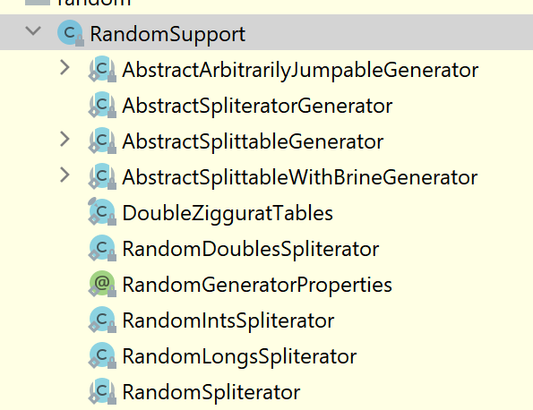

所以以前：

**Java 16  **

```java
// Random.java
public DoubleStream doubles() {
    return StreamSupport.doubleStream
        (new RandomDoublesSpliterator
         (this, 0L, Long.MAX_VALUE, Double.MAX_VALUE, 0.0),
         false);
}

// SplittableRandom.java
public DoubleStream doubles(long streamSize, double randomNumberOrigin,
                            double randomNumberBound) {
    if (streamSize < 0L)
        throw new IllegalArgumentException(BAD_SIZE);
    if (!(randomNumberOrigin < randomNumberBound))
        throw new IllegalArgumentException(BAD_RANGE);
    return StreamSupport.doubleStream
        (new RandomDoublesSpliterator
         (this, 0L, streamSize, randomNumberOrigin, randomNumberBound),
         false);
}
```

有相似的地方吧。我们再来看看 Java 17 的实现：

**Java  17**

```java
// Random.java
public DoubleStream doubles() {
    return AbstractSpliteratorGenerator.doubles(this);
}

//SplittableRandom.java
private AbstractSplittableGeneratorProxy proxy;
...
public DoubleStream doubles() {
    return proxy.doubles();
}
...
private class AbstractSplittableGeneratorProxy extends AbstractSplittableGenerator {
    @Override
    public int nextInt() {
        return SplittableRandom.this.nextInt();
    }

    @Override
    public long nextLong() {
        return SplittableRandom.this.nextLong();
    }

    @Override
    public java.util.SplittableRandom split(SplittableGenerator source) {
        return new SplittableRandom(source.nextLong(), mixGamma(source.nextLong()));
    }
}
```

而这个 AbstractSplittableGenerator 就定义在 RandomSupport.java 当中，是 RandomSupport 一个内部类。


你以为这就没了？不是的。提案的说明当中提到，提案的目标不是实现很多的随机数产生算法，不过这次还是添加了一些常见的实现，所以你会在 JDK 17 当中看到多了一个模块：

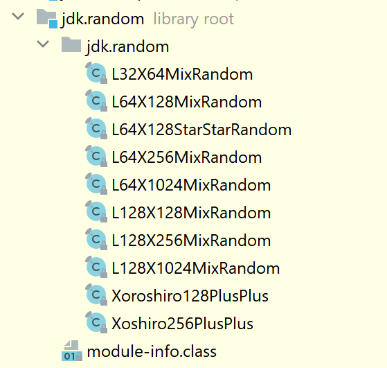

这些实现都有自己的名字用注解标注出来，例如：

```java
@RandomGeneratorProperties(
        name = "L32X64MixRandom",
        group = "LXM",
        i = 64, j = 1, k = 32,
        equidistribution = 1
)
public final class L32X64MixRandom extends AbstractSplittableWithBrineGenerator { ... }
```

使用方法也很简单：

```java
var random = RandomGenerator.of("L32X64MixRandom");
for (int i = 0; i < 10; i++) {
    System.out.println(random.nextInt());
}
```


## JEP 382: New macOS Rendering Pipeline

不知道大家在 macOS 上用 IntelliJ IDEA 或者 Android Studio 会不会觉得卡，就是那种在本地打字打出了远程控制的感觉的那种卡，解决办法也很简单，把窗口调小一点儿就行。

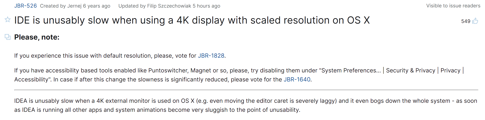

我有个 2015 款的 MacBook Pro，之前我用它连 4K 外接显示器写代码，发现很快电脑就发烫发热，IDE 也会卡得不成样子。一开始我以为是我的电脑快不行了，后来我发现很多用最新款 MacBook 的人也在抱怨 IntelliJ IDEA 的垃圾性能。


结果发现 JetBrains 把锅甩给了 JDK。JDK 也不客气，直接用 IntelliJ IDEA 做测试：

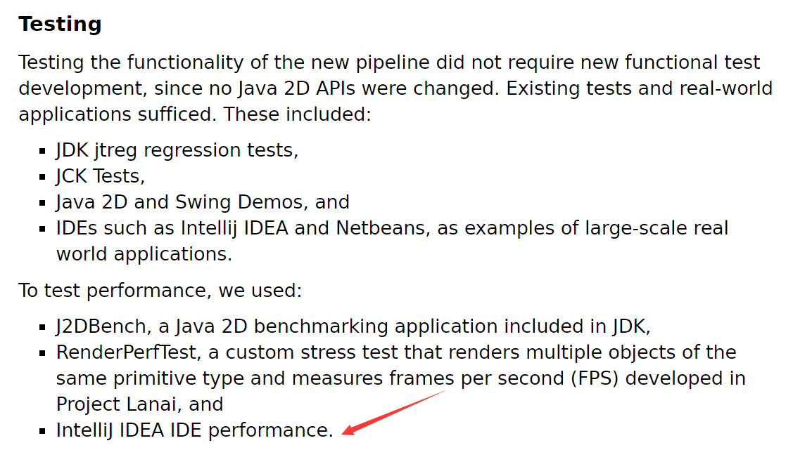

简单来说就是 Mac 上以前 Java 2D 的 API 是基于 OpenGL 的，从 Java 17 开始则提供了基于最新的 Metal Framework 的实现。目前默认还是基于 OpenGL，这样对于线上的程序几乎没有负面影响，如果大家需要启用 Metal 的支持，则需要在 虚拟机参数当中添加：

```
-Dsun.java2d.metal=true
```

Metal 在后面也应该会成为默认选择。

所以这条更新，建议使用 Mac 的小伙伴们密切关注，也建议开发 Mac 桌面程序的小伙伴尽快适配。

（跟我有什么关系，Windows 11 YYDS! ）


对了，我在 Mac M1 上下载了 Java 17 的 arm64 版本（下一条将会提到），然后用 AppCode（JetBrains 全家桶当中用来写 iOS 程序的 IDE） 替换了这个 JDK，并在 JVM 参数当中配置了：

```
-Dsun.java2d.metal=true
```

接了 4K 显示器以后，代码编写和代码提示的速度有了明显的提升，大家可以试试看。

## JEP 391: macOS/AArch64 Port

噗。。。还记得我司刚给小伙伴们发了一台高贵的 Apple Silicon 的 Air 的时候，有大佬还专门写教程告诉我们去哪儿找 [arm64 的 JDK](https://www.azul.com/downloads/?version=java-11-lts&os=macos&architecture=arm-64-bit&package=jdk)：

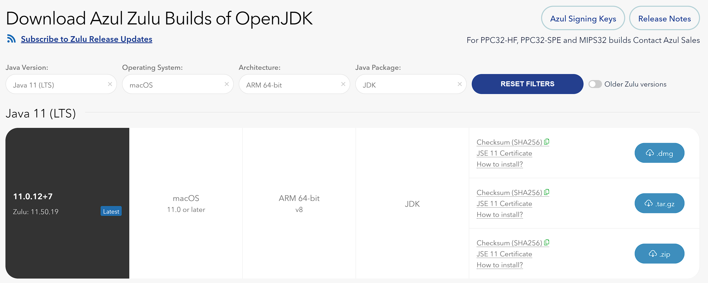

这回 Java 官方终于也支持了，直接到 [Oracle 的网站](https://www.oracle.com/java/technologies/javase/jdk17-archive-downloads.html)上就能下载，要知道 Java 16 的时候还只有 x86 的版本：

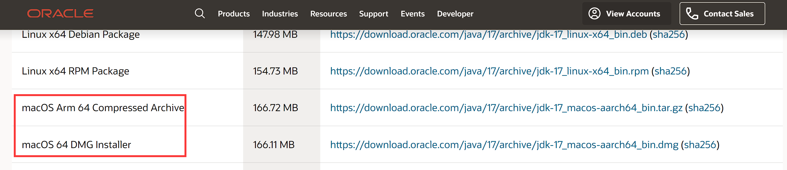

哎，等等，下面的 DMG Installer 是不是丢了个 Arm 啊。。这得扣钱啊小编。

 	

## JEP 398: Deprecate the Applet API for Removal

这一条对大家的影响几乎没有。

大多数 Java 程序员应该接触过 Servlet，其实在浏览器端对应的还有个 applet，但那已经是很早的时候的东西了。十几年前我开始学 Java 的时候，applet 就已经几乎没有应用场景了，谁又想在打开个网页的时候还要启动一个 Java 虚拟机呢？

随着浏览器对 JavaScript 的支持越来越完善，在浏览器端开发程序的需求都可以轻松地被 JavaScript 满足。终于在 Java 9 发布的时候 applet 被标记为废弃，在 Java 17 它被进一步标记为移除了：

```java
@Deprecated(since = "9", forRemoval = true)
@SuppressWarnings("removal")
public class Applet extends Panel { ... }
```

这意味着在 JDK 17 当中，我们还是可以看到 Applet 的，不过它即将在未来的版本当中彻底消失。

## JEP 403: Strongly Encapsulate JDK Internals

这一条对于使用 JDK 内部 API 的应用场景来讲会比较受影响。

实际上 JDK 给开发者提供了相当长的过渡期，从 Java 9 引入模块化开始，JDK 对于其内部的 API 的访问限制就已经明确开始落地，只是当时我们可以通过启动参数 --illegal-access=permit 来继续使用 JDK 的内部 API，其中 Java 9 - Java  15 默认 permit，Java 16 默认 deny。

现在不可以了。在 Java 17 当中使用 --illegal-access 将会得到以下警告，并且没有任何效果：

```
Java HotSpot(TM) 64-Bit Server VM warning: Ignoring option --illegal-access=permit; support was removed in 17.0
```

按照提案的说明，被严格限制的这些内部 API 包括：

*  java.* 包下面的部分非 public 类、方法、属性，例如 Classloader 当中的 defineClass 等等。
* sun.* 下的所有类及其成员都是内部 API。
* 绝大多数 com.sun.* 、 jdk.* 、org.* 包下面的类及其成员也是内部 API。

举个例子：

```java
package com.sun.beans;

...
public final class WeakCache<K, V> {
    private final Map<K, Reference<V>> map = new WeakHashMap<K, Reference<V>>();

    public V get(K key) { ... }

    public void put(K key, V value) { ... }
	...
}

```

在 java.desktop 模块下有这么一个类，非常简单，就是对 WeakHashMap 做了个包装。我想要用一下它，我该怎么办呢？

复制一份到我的工程里面。


不是，不是。。。好的程序员不应该 CV 代码。。。所以我直接使用它。

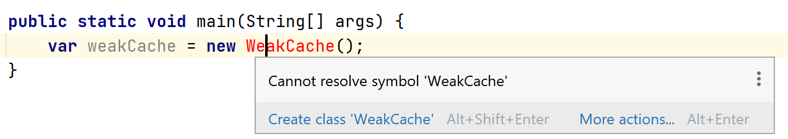

啊，不行。那我可以反射呀~ 我可真是个小机灵鬼。这波反射下来真实无人能敌。

```java
try {
    var weakCacheClass = Class.forName("com.sun.beans.WeakCache");
    var weakCache = weakCacheClass.getDeclaredConstructor().newInstance();
    var putMethod = weakCacheClass.getDeclaredMethod("put", Object.class, Object.class);
    var getMethod = weakCacheClass.getDeclaredMethod("get", Object.class);
    putMethod.invoke(weakCache, "name", "bennyhuo");
    System.out.println(getMethod.invoke(weakCache, "name"));
} catch (Exception e) {
    e.printStackTrace();
}
```


满怀欣喜的运行它。。。

```java
java.lang.IllegalAccessException: class com.bennyhuo.java17.ReflectionsInternal cannot access class com.sun.beans.WeakCache (in module java.desktop) because module java.desktop does not export com.sun.beans to unnamed module @776ec8df
	at java.base/jdk.internal.reflect.Reflection.newIllegalAccessException(Reflection.java:392)
	at java.base/java.lang.reflect.AccessibleObject.checkAccess(AccessibleObject.java:674)
	at java.base/java.lang.reflect.Constructor.newInstanceWithCaller(Constructor.java:489)
	at java.base/java.lang.reflect.Constructor.newInstance(Constructor.java:480)
	at com.bennyhuo.java17.ReflectionsInternal.useWeakCache(ReflectionsInternal.java:16)
	at com.bennyhuo.java17.ReflectionsInternal.main(ReflectionsInternal.java:10)
```

en？？？这让我想起了 Android P，你看这个字母 P，它的发音充满了挑衅，它的形状还有点儿像官方在嘲笑我们


现在 Java 17 也玩这个啊，反射都不行了啊这。。

Java 16 我们可以通过在运行时加入 `--illegal-access=permit` 来运行，虽然会有一堆警告：

```
# java --illegal-access=permit com.bennyhuo.java17.ReflectionsInternal

Java HotSpot(TM) 64-Bit Server VM warning: Option --illegal-access is deprecated and will be removed in a future release.
WARNING: An illegal reflective access operation has occurred
WARNING: Illegal reflective access by com.bennyhuo.java17.ReflectionsInternal (file:/mnt/c/Users/benny/WorkSpace/Mario/SourceCode/Java17UpdatesDemo/src/) to constructor com.sun.beans.WeakCache()
WARNING: Please consider reporting this to the maintainers of com.bennyhuo.java17.ReflectionsInternal
WARNING: Use --illegal-access=warn to enable warnings of further illegal reflective access operations
WARNING: All illegal access operations will be denied in a future release
bennyhuo
```

不过正如我们前面所说，Java 17 当中这个参数无效了

```
# java --illegal-access=permit com.bennyhuo.java17.ReflectionsInternal

Java HotSpot(TM) 64-Bit Server VM warning: Ignoring option --illegal-access=permit; support was removed in 17.0
java.lang.IllegalAccessException: class com.bennyhuo.java17.ReflectionsInternal cannot access class com.sun.beans.WeakCache (in module java.desktop) because module java.desktop does not export com.sun.beans to unnamed module @372f7a8
d
        at java.base/jdk.internal.reflect.Reflection.newIllegalAccessException(Reflection.java:392)
        at java.base/java.lang.reflect.AccessibleObject.checkAccess(AccessibleObject.java:674)
        at java.base/java.lang.reflect.Constructor.newInstanceWithCaller(Constructor.java:489)
        at java.base/java.lang.reflect.Constructor.newInstance(Constructor.java:480)
        at com.bennyhuo.java17.ReflectionsInternal.useWeakCache(ReflectionsInternal.java:16)
        at com.bennyhuo.java17.ReflectionsInternal.main(ReflectionsInternal.java:10)
```

这就是上帝在关门的时候（Java 9），顺便也提醒我们窗户也马上要关上了，还不赶紧给我出去？然后上帝又花了三年把窗户也关上了。不过，它总算是还留了一个通气孔。。。

 Java  17 当中 --add-opens 仍然有效，通过开启它可以让我们的程序还可以在运行时通过反射访问指定的类：

```
--add-opens java.desktop/com.sun.beans=ALL-UNNAMED
```

所以，上面的代码想要运行，只能：

```
# java --add-opens java.desktop/com.sun.beans=ALL-UNNAMED com.bennyhuo.java17.ReflectionsInternal

bennyhuo
```

所以这波是要来真的，赶快跑吧！


大家也可以参考 [受影响的 API 清单](https://cr.openjdk.java.net/~mr/jigsaw/jdk8-packages-strongly-encapsulated) 来规划自己的 JDK 升级。

## JEP 406: Pattern Matching for switch (Preview)

这是一个预览特性。

前面我们提到过 Java 16 引入了一个对于 instanceof 的模式匹配：

```java
// Old code
if (o instanceof String) {
    String s = (String)o;
    ... use s ...
}

// New code
if (o instanceof String s) {
    ... use s ...
}
```

这个其实从效果上类似于 Kotlin 的智能类型转换：

```kotlin
if (o is String) {
    // now `o` is smart casted to String 
    println(o.length())
}
```

不过，模式匹配可以做的事情更多。

Java 17 引入了一个 preview 的特性，可以通过 switch 语句来实现类似的类型模式匹配：

```java
static String formatterPatternSwitch(Object o) {
    return switch (o) {
        case Integer i -> String.format("int %d", i);
        case Long l    -> String.format("long %d", l);
        case Double d  -> String.format("double %f", d);
        case String s  -> String.format("String %s", s);
        default        -> o.toString();
    };
}
```

对于每一个 case 语句，我们都可以使用类型模式匹配，如果 o 的类型是 Integer，那么它就可以匹配到第一个 case 分支，并且在这个分支内部可以用新变量 i 来替代 o。

请注意，switch 语句在 Java 14 正式支持了表达式，有些朋友可能对这个语法不是很熟悉， 每一个 case  语句后面的 `->` 都是一个表达式，并且不会落到下一个 case 分支，所以大家也不会在这里看到 break。


模式匹配在 Java 的近亲 Scala 上得到了广泛的运用，当然 Scala 的模式匹配要复杂得多，下面是我从 Scala 官网摘的例子：

```scala
abstract class Notification
case class Email(sender: String, title: String, body: String) extends Notification
case class SMS(caller: String, message: String) extends Notification
case class VoiceRecording(contactName: String, link: String) extends Notification

def showNotification(notification: Notification): String = {
  notification match {
    case Email(sender, title, _) => s"You got an email from $sender with title: $title"
    case SMS(number, message) => s"You got an SMS from $number! Message: $message"
    case VoiceRecording(name, link) => s"You received a Voice Recording from $name! Click the link to hear it: $link"
  }
}
```

case class 类似于 Java 当中的 record，或者 Kotlin 当中的 data class，我们看到下面的 match 语句当中，`case Email(sender, tit le, _)` 语句可以直接对待匹配的对象做解构。此外，还可以添加模式守卫（Pattern Guard），例如：

```scala
def showImportantNotification(notification: Notification, importantPeopleInfo: Seq[String]): String = {
  notification match {
    case Email(sender, _, _) if importantPeopleInfo.contains(sender) => "You got an email from special someone!"
    case SMS(number, _) if importantPeopleInfo.contains(number) => "You got an SMS from special someone!"
    case other => showNotification(other) // nothing special, delegate to our original showNotification function
  }
}
```

注意每一条 case 后面的 if，在匹配的时候，也需要命中 if 后面的表达式。


Java 在后续的发展过程当中也许也存在添加这样的语法的可能性。

Kotlin 在演进的过程中曾经也一度想要把 when 表达式做成模式匹配，不过可能是后面觉得模式匹配的实用价值不高（???），就没有继续做下去。


稍微提一下，如果想要体验预览特性，需要为 Java 编译器和 Java 运行时添加 `--enable-preview` 参数。

## JEP 407: Remove RMI Activation

这个是远程调用相关的一套 API，由于这个东西的维护成本越来越高，用得人越来越少，Java 官方决定把它干掉。实际上这套 API 在 Java 8 被标记为可选，Java 15 被标记为废弃，也算是留足了时间了。

需要注意的是，移除的只是 java.rmi.activation 包，其他远程调用的能力都不受影响。

## JEP 409: Sealed Classes

密封类从 Java 15 开始预览，Java 16 又预览了一波，终于在 Java 17 转正了（实际上 Java 16 和 17 的密封类是一样的）。

Kotlin 从 1.0 开始就有密封类，并且对子类定义位置的限制从父类内部（Kotlin 1.0）到同一个文件（Kotlin 1.1）再到同一个包内（Kotlin 1.5），但实际使用上没有什么特别大的变化 —— 直到 Java 也支持密封类和密封接口，Kotlin 才也对密封接口做了支持。

从定义上来讲，二者的密封类、接口都是限制直接子类的定义，使得直接子类是可数的。例如：

```java
package com.example.geometry;

public abstract sealed class Shape 
    permits com.example.polar.Circle,
            com.example.quad.Rectangle,
            com.example.quad.simple.Square { ... }
```

注意，在 Java 当中，密封类的子类的定义也有一些限制，如果父类在具名模块当中，那么子类必须也定义该模块内部；否则，子类就必须定义在父类相同的包当中。如果子类比较小，可以直接定义在父类当中，此时 permits 就不用显式写出了：

```java
abstract sealed class Root { ... 
    static final class A extends Root { ... }
    static final class B extends Root { ... }
    static final class C extends Root { ... }
}
```

对于密封类的子类来讲，既可以声明为 final 来禁止被继承；也可以声明为 sealed 来使得该子类的直接子类可数；也可以声明为 non-sealed 来使得该子类的子类不受限制。因此我们说密封类可以确保其直接子类可数。例如：

```java
abstract sealed class Root {
    static final class A extends Root { }

    static sealed class B extends Root {
        static final class B1 extends B {}
        static final class B2 extends B {}
    }

    static non-sealed class C extends Root { }
}
```

有了密封类再配合前面提到的 switch 模式匹配，就很好用了：

```java
Root r = new Root.A();
var x = switch (r) {
    case Root.A a -> 1;
    case Root.B b -> 2;
    case Root.C c -> 3;
};
```

密封接口的支持也是类似的。

密封类实际上也是一个很有用的特性，我之前在介绍 Kotlin 的密封类的时候也已经提到过不少它的用法，这里就不展开了。


## JEP 410: Remove the Experimental AOT and JIT Compiler

这里提到的 AOT（即 Ahead of time）编译器和 JIT（即 Just in time）编译器是基于 Java 代码开发出来的 Graal 编译器开发而来的，它们分别在 Java 9 和 Java 10 被引入 JDK 并开始试验，不过很少有人用它们。

我们知道 Java 代码编译之后生成虚拟机字节码，由虚拟机负责解释执行。由于字节码并不是机器码，因此笼统的说 Java 代码的执行效率并不如 C/C++ 这样的 Native 语言（当然实际情况要看具体场景，也跟虚拟机的优化有很大的关系）。既然 Native 的机器码执行效率更高，那么我们是不是可以直接把字节码编译成机器码，然后再去执行呢？听上去确实是一个好主意。


也就是 AOT 的由来了。移动端对于性能更加敏感，因而我们更多的时候听到 AOT 这个词是在对Android ART 和 Flutter 的 Dart 的说明文档当中。

JIT 则是在运行的时候对热点代码的实时编译。

这里要移除的其实就是基于 Graal 编译器实现的这俩个实验当中的编译器，理由呢，也很直接：没人用，还难以维护，投入产出比太低了。


当然，这也不是说 Java 就不能编译成 Native 二进制可执行程序直接运行，因为我们还有 [GraalVM](https://www.graalvm.org/)，这家伙居然还支持 Node.js 和 Ruby：

 

额，还有 Python、R 和 LLVM：


还叫板 LLVM，有点儿东西哦~

## JEP 411: Deprecate the Security Manager for Removal

与 applet 类似，SecurityManager 也被标记为废弃且即将移除：

```java
@Deprecated(since="17", forRemoval=true)
public class SecurityManager { ... }
```

一般业务开发不太会用到这个东西，我们就不过多介绍了。


##  JEP 412: Foreign Function & Memory API (Incubator)

这个提案主要应对的场景就是调用 Java VM 以外的函数，即 Native 函数；访问 Java VM 以外的内存，即堆外内存（off-heap memory）。

这不就是要抢 JNI 的饭碗吗？


对，这个提案里面提到的堆外内存和代码访问都可以用 JNI 来做到，不过 JNI 不够好用，还够不安全。

Java 程序员不仅需要编写大量单调乏味的胶水代码（JNI 接口），还要去编写和调试自己本不熟悉（绝大多数应该真的不熟悉）的 C、C++ 代码，更要命的是很多时候调试工具也没有那么好用。当然，这些都可以克服，不过 Java 和 C、C++ 的类型系统却有着本质的区别而无法直接互通，我们总是需要把传到 C、C++ 层的 Java 对象的数据用类似于反射的 API 取出来，构造新的 C、C++ 对象来使用，非常的麻烦。

我甚至在公司内见过有人用 C++ 基于 JNI 把 Java 层的常用类型都封装了一遍，你能想象在 C++ 代码当中使用 ArrayList 的情形吗？我当时一度觉得自己精神有些恍惚。


这些年来 Java 官方在这方面也没有什么实质性的进展。JNI 难用就难用吧，总算还有得用，一些开源的框架例如 JNA、JNR、JavaCPP 基于 JNI 做了一些简化的工作，总算让 Java 与 Native 语言的调用没那么令人难受。

你可能以为这个提案的目的也是搞一个类似的框架，其实不然。Java 官方嘛，不搞就不搞，要搞就搞一套全新的方案，让开发者用着方便，程序性能更好（至少不比 JNI 更差），普适性更强，也更安全。


稍微提一下，堆外内存访问的 API 从 Java 14 就开始孵化，到 Java 17 连续肝了四个版本了已经，仍然还是 incubator；访问外部函数的 API 则从 Java 16 开始孵化，到现在算是第二轮孵化了吧。如果大家要想在自己的程序里面体验这个能力，需要给编译器和虚拟机加参数：

```
--add-modules jdk.incubator.foreign
```

### 访问堆外内存

基于现在的方案，我们有三种方式能访问到堆外内存，分别是

* ByteBuffer（就是 allocateDirect），这个方式用起来相对安全，Java 程序员看起来其实似乎并没有直接操作堆外内存，但执行效率相对一般：

  ```java
  public static ByteBuffer allocateDirect(int capacity) {
      return new DirectByteBuffer(capacity);
  }
  ```

* 使用 Unsafe 的方法，这个方式经过了 JIT 优化效率较高，但非常不安全，因为它实际上可以访问到任意位置的内存，例如：

  ```java
  Unsafe unsafe = ...;
  var handle = unsafe.allocateMemory(8); // 申请 8 字节内存
  
  unsafe.putDouble(handle, 1024); // 往该内存当中写入 1024 这个 double
  System.out.println(unsafe.getDouble(handle)); // 从该内存当中读取一个 double 出来
  
  unsafe.freeMemory(handle); // 释放这块内存
  ```

* 使用 JNI，通过 C/C++ 直接操作堆外内存。

不管哪种方式，对于 Java 程序员来讲，它们都不是特别友好。

接下来我们看一下新的内存访问方案，它主要包括以下几方面：

#### 堆外内存分配

我们可以通过 MemorySegment 来做到这一点：

```java
MemorySegment segment = MemorySegment.allocateNative(100, ResourceScope.newImplicitScope());
```

尽管看上去跟前面的 Unsafe 类似，但请注意 ResourceScope 这个参数，我们会在后面介绍；另外对于堆外内存的访问也是受限制的，就像访问数组一样更加安全。

#### 堆外内存访问

在堆外内存开辟以后，我们通常需要按照某种变量的方式去访问它，例如想要以 int 的方式读写，那么就创建一个 VarHandle 即可：

```java
VarHandle intHandle = MemoryHandles.varHandle(int.class, ByteOrder.nativeOrder());
```

这里支持的类型就是基本类型，包括 byte、short、char、int、float、long、double。

```java
for (int i = 0; i < 25; i++) {
    intHandle.set(segment, /* offset */ i * 4, /* value to write */ i);
}
```

我们知道 Java 的 int 占 4 个字节，因此直接对前面开辟的内存 segment 进行读写操作即可。那如果我读写的范围越界会发生什么呢？

```java
intHandle.set(segment, 100 /* out of bounds!! */, 1000);
```

运行程序结果发现抛了个异常，这个异常就是 MemorySegment 抛出来的：

```
Exception in thread "main" java.lang.IndexOutOfBoundsException: Out of bound access on segment MemorySegment{ id=0x17366e0a limit: 100 }; new offset = 100; new length = 4
```

这样相比使用 Unsafe 访问内存的好处就在于受控制。这个感觉特别像我们从 C 时代转到 Java 时代是遇到的 C 指针和 Java 引用的对比一样，我们不妨再给大家看看 Unsafe 的例子，看看是不是如同操作 C 指针一样：

```java
var handle = unsafe.allocateMemory(16);

// 操作分配的内存之后的部分，实际上这部分内存完全不可预见
unsafe.putInt(handle + 16, 1000); 
// 读取非法内存，报不报错完全取决于实际的内存会不会错乱
System.out.println(unsafe.getInt(handle + 16)); 

unsafe.freeMemory(handle);
// 内存已经回收了，继续读
System.out.println(unsafe.getInt(handle)); 
```

这就是相比之下新方案更安全的地方。不仅如此，对于内存的回收，一旦忘记，就是内存泄漏；不仅如此，内存有没有回收我们其实完全无法通过  handle 来做出判断，如果已经回收，handle 不就是野指针了嘛。


另外，新 API 还提供了一套内存布局相关的 API：

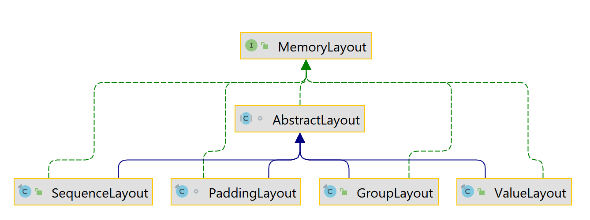

这套 API 的目的就是可以降低访问堆外内存时的代码复杂度，例如：

```java
SequenceLayout intArrayLayout = MemoryLayout.sequenceLayout(25, MemoryLayout.valueLayout(32, ByteOrder.nativeOrder()));
MemorySegment segment = MemorySegment.allocateNative(intArrayLayout, newImplicitScope());
VarHandle indexedElementHandle = intArrayLayout.varHandle(int.class, PathElement.sequenceElement());
for (int i = 0; i < intArrayLayout.elementCount().getAsLong(); i++) {
    indexedElementHandle.set(segment, (long) i, i);
}
```

这样我们在开辟内存空间的时候只需要通过 SequenceLayout 描述清楚我们需要什么样的内存（32bit，Native 字节序），多少个（25 个），然后用它去开辟空间，并完成读写。

* PaddingLayout 会在我们需要的数据后添加额外的内存空间，主要用于内存对齐。
* ValueLayout 用来映射基本的数值类型，例如 int、float 等等。
* GroupLayout 可以用来组合其他的 MemoryLayout，它有两种类型，分别是 STRUCT 和 UNION，熟悉 C 语言的小伙伴们一下就明白了，在调用 C 函数的时候它非常有用，可以用来映射 C 的结构体和联合体。

在调用 C 函数时，我们可以很方便地使用这些 MemoryLayout 映射到 C 类型。

#### 堆外内存的作用域

作用域这个东西实在是关键。

我们 Java 程序员最喜欢 Java 的一点就是内存管理很少让我们操心，因为内存都被虚拟机接管了，我们只需要使劲儿造内存，虚拟机就像个大管家一样默默的为我们付出。这极大的降低了程序员管理内存的成本，也极大的降低了程序员在内存操作上犯错误的可能，对比我之前写 C++ 的时候经常因为某个内存错误查半夜找不到头绪的情况，用 Java 写程序开发效率的提升真不是一点儿半点儿。

说起来前一段时间公司组织应届生培训，我负责讲 Kotlin 基础，跟 Swift 的讲师一起准备内容，他们一直强调一定要讲讲内存管理机制，如何避免内存泄漏。我一听，都不好意思说内存泄漏这事儿我要讲点儿啥了，跟他们比起来，我们的内存泄漏大多数情况就是内存回收的晚一点儿（容易导致突然开辟大块内存的时候 OOM），他们可是真的就不能回收了啊，我们这简直弱爆了。


所以要想让 Java 程序员用得舒服，那必须把堆外内存的管理也尽可能做到简单易用。为此，JDK 提供了资源作用域的概念，对应的类型就是 ResourceScope。这是一个密封接口，因此我们无法直接实现这个接口，但它有且仅有一个非密封的实现类 ResourceScopeImpl，JDK 还提供了三种具体的实现：

* GLOBAL：这实际上是一个匿名内部类对象，它是全局作用域，使用它开辟的堆外内存不会自动释放。
* ImplicitScopeImpl：我们在前面演示新 API 的使用时已经提到过，调用 `ResourceScope.newImplicitScope()` 返回的正是 ImplicitScopeImpl。这种类型的 Scope 不能被主动关闭，不过使用它开辟的内存会在持有内存的 MemorySegment 对象不再被持有时释放。这个逻辑在 CleanerImpl 当中通过 ReferenceQueue 配合 PhantomReference 来实现。
* SharedScope：最主要的能力就是提供了多线程共享访问的支持；是 ImplicitScopeImpl 的父类，二者的差别在于 SharedScope 可以被主动关闭，不过必须确保只能被关闭一次。
* ConfinedScope：单线程作用域，只能在所属的线程内访问，比较适合局部环境下的内存管理。

我们再看一个例子：

```java
try(var scope = ResourceScope.newConfinedScope()) {
    MemorySegment memorySegment = MemorySegment.allocateNative(100, scope);
    ...
}
```

这个例子当中我们使用 ConfinedScope 来开辟内存，由于这个 scope 在 try-resource 语句结束之后就会被关闭，因此其中开辟的内存也会在语句结束的时候理解回收。

