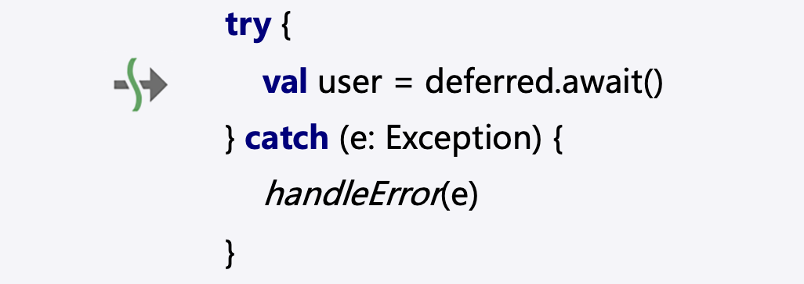

# 闲话 Swift 协程（1）：Swift 的异步函数调用为什么总是要 await？

**Swift Swift5.5**

> 2021 年 9 月 20 日，Apple 发版了 Swift 5.5，这个版本当中最亮眼的特性就是对 async await 的支持了。

==  Swift|Coroutines|async await ==

### 貌合神离的 async/await 设计

通过前面的介绍，我们已经知道 async 可以定义异步函数，await 可以等待异步函数的结果。

那么讲到这里，有一个比较有意思的话题需要讨论一下了：Kotlin 用了一个 suspend 关键字来实现 async await 的作用，看上去很不错，也比较省事儿，为什么其他语言还都要使用 async await 呢？

我们抛开本身 Kotlin 自己的一些设计和规划上的野心不谈，单纯来看一下这二者效果上的差异。如果我们拥有 await 关键字，我们在使用 await 关键字时可以实现与 Kotlin 的 suspend 函数调用时相同的语义；但如果我们在调用异步函数时不用 await 关键字呢？显然，对于使用 async await 设计的语言，它们有条件这样做。

### JavaScript 异步函数调用的可选 await 

在 JavaScript 当中，我们把 await 关键字去掉是没有问题的，例如：

**JavaScript**

```javascript
async function delay(seconds) {
  ...
}
async function asyncCall() {
	delay(2); // 调用异步函数，不过不等待结果
	...
}
```

这样的实际效果类似于启动了一个异步任务，但我不关心它的结果，因此 delay 函数后面的代码会立刻执行而不会等待 delay 的结果。

大家看，引入 await 关键字就有这样的好处，我们可以在不需要的时候不用它。这样真的有意义吗？我们再看一个例子：

**JavaScript**

```javascript
async function getImage(url) { ... }
async function asyncCallSerial(urls) {
  for(let url of urls) {
    let image = await getImage(url); // 一张一张地获取并处理图片
    ...
  }
}
```

由于 await 会使得 asyncCallSerial 的执行被挂起，一直等到 getImage 返回一张图片之后才会继续，因此我们实际上是串行调用 getImage 的。如果 getImage 是从网络当中下载图片，那么这个 asyncCallSerial 函数的执行效率就显得不够高。

有没有什么办法并行获取这些图片呢？

**JavaScript**

```javascript
async function getImage(url) { ... }
async function asyncCallParallel(urls) {
	let images = await Promise.all(urls.map(async (url) => getImage(url)));
}
```

上面这个写法就可以批量获取图片，其中关键之处就是 getImage 的调用没有被 await。请注意 `async (url) => getImage(url)` 实际上是一个 lambda 表达式（在 JavaScript 当中被称为箭头函数，也类似于 Swift 当中的 Closure），通过 urls 的 map 函数将整个数组映射成 getImage 函数对每一个 url 的调用之后的结果的数组，再使用 Promise.all 将这个数组整合成一个异步函数调用，最后整体 await 得到图片的数组。

讲到这儿，我希望大家不要过于纠结前面的 JavaScript 语法细节，大家只需要知道通过引入 await 关键字，我们就可以不必在调用异步函数的时候僵硬地等待了，我们也可以稍后再等。

### Swift 异步函数调用的强制 await

尽管 Swift 也引入了类似的 await 关键字，不过 Swift 却要求异步函数调用必须要用 await 关键字来修饰。这样 Swift 就不能像 JavaScript 那样不使用 await 调用异步函数，反而效果上更类似于 Kotlin 的做法 —— 外形相似的反而不一样，这其中一定有古怪。

我们首先可以肯定的一点是，异步函数调用处强制 await，在代码阅读上更直接。

这不难理解，我过去几年在做 Kotlin 协程的推广过程中一直有个痛点，在 PPT 上展示协程代码的时候我们很难看出来调用的函数当中哪个是 suspend 函数：

```kotlin
try { 
  // 下这句是对异步函数的调用，但从代码上不容易直接看出来
  val user = deferred.await()
} catch(e: Exception) {
  handleError(e)
}
```

这在 IDE 当中当然不是什么问题，因为 IDE 会有一个 icon 提示我们，于是我干脆把 IDE 当中的 icon 取出来贴到 PPT 里面：



Swift 的异步函数调用因为 await 的存在，会变得很清晰：

```swift
try await AF.request(url).responseDataAsync()
```

就这代码，明眼人一看就知道是对异步函数的调用。

当然，你能说就为了这一点便利性，Swift 的设计者就要让大家每次调用异步函数的时候都多敲 6 个字符吗（包含一个空格）？显然理由成立，但也不够充分。所以这里一定有一个非常重要的原因导致 Swift 的异步函数的调用只能 await。我们稍微理一下现在的情况：

1. Swift 的语法设计选择了 async/await，形式上与 JavaScript 几乎一致
2. Swift 的异步函数调用强制需要 await，这一点与 JavaScript 不同
3. Swift 的异步函数调用强制需要 await，这一点与 Kotlin 对异步函数的调用行为一致，也正式因为每次都要写 await 这个关键字，Kotlin 的设计者们觉得只需要一个关键字就够了。

要想搞清楚这其中的缘由，我们就只能从这三者的协程实现上入手了。
